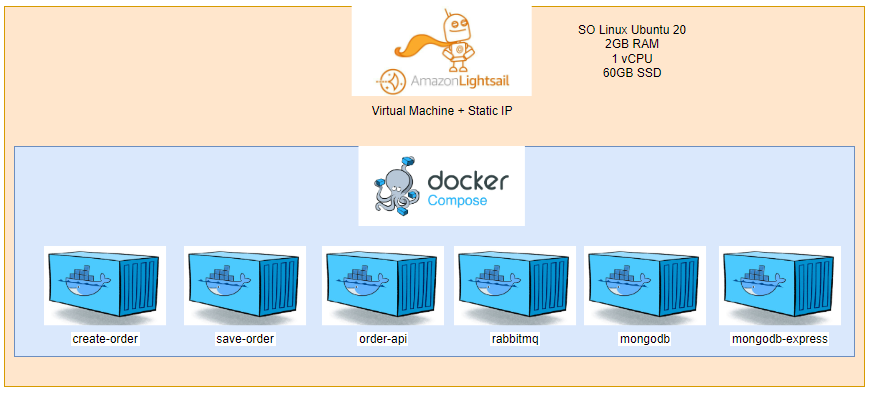

# Java-RabbitMQ

## Como Rodar Local

### Aplicação

Para executar o programa local baixe o arquivo ```docker-compose.yml``` e execute ```docker compose up --build```

Ou se preferir executar o programa fazendo o build das aplicações, sem baixá-las do docker-hub execute o clone do projeto com o comando ```git clone https://github.com/DanMke/java-rabbitmq.git``` e após isso execute ```docker compose -f docker-compose-local.yml up --build```

As portas utilizadas serão: 

- 8080: Create Order
- 8081: Mongo Express
- 27017: MongoDB
- 5672: RabbitMQ
- 15672: RabbitMQ
- 8082: Save Order
- 8083: Order API


Ao subir o docker compose com os containers, atente-se aos seguintes pontos:

- O serviço create-order tem dependência do rabbitmq, e tentará a conexão com o rabbitmq até que ele termine de subir e se conectar com o sucesso. Ao se conectar, já serão criadas a fila, exchange e routingkey.

- O serviço save-order tem dependência do rabbitmq e do mongodb, e tentará a conexão com ambos até que terminem de subir e se conectem com sucesso. Ao se conectar ele começará a escutar a fila, e criará a database, collection e índices no mongodb.

Por isso é necessário aguardar um tempo após a execução do docker compose para que ele estabilize as conexões.

### Teste Automatizado

Também é possível executar os testes automatizados a partir de um script Python, que realizará todo o fluxo:

1 - Lê do arquivo ```orders.json``` os objetos de pedidos

2 - Os objetos de pedidos são enviados para a fila no rabbitmq

3 - O código aguarda alguns segundos para dar tempo de salvar no banco de dados

4 - São feitas as requisições para os endpoints do order-api para demonstrar o funcionamento de cada um deles

Para isso é necessário ter instalado o python3 e o pip3.

Então entre na pasta ```automated-test```, faça o download das dependências com o comando ```pip3 install -r requirements.txt``` e execute o código com ```python3 automated-test.py```.

OBS: O arquivo está apontando para o IP da máquina virtual na AWS em que foi feita a implantação da aplicação


## Diagrama de Arquitetura

A seguinte imagem demonstra o diagrama de arquitetura dos serviços da aplicação


## Diagrama da Implantação

A seguinte imagem demonstra o diagrama da implantação do código na nuvem AWS

Foi contratada uma máquina virtual no Lighsail da AWS com os seguintes recursos:

- SO Linux Ubuntu 20
- 2GB RAM
- 1 vCPU
- 60GB SSD



## Modelagem da Base de Dados

Para melhor desempenho nas consultas, foram criados índices nos campos de codigoPedido e codigoCliente, além de inserir como UNIQUE o campo de codigoPedido.

```
{
		"codigoPedido": 1001,
		"codigoCliente": 1,
		"itens": [
			{
				"produto": "lápis",
				"quantidade": 100,
				"preco": 1.1
			},
			{
				"produto": "caderno",
				"quantidade": 10,
				"preco": 1.0
			}
		]
}
```

## Plano de Trabalho

Para organização este trabalho foi utilizado o Trello.

O diagrama de arquitetura e de implantação foram desenhados antes do código e só foi alterada a parte interna ao RabbitMQ e os recursos da máquina virtual.

## Tecnologias Utilizadas

- Linguagens: Python 3.8 e Java 17.0.5

- IDE: Visual Studio Code 1.74.3

- Ferramentas: SpringBoot 3.0.1, Maven 3.6.3, Docker 20.10.21, Docker Compose 2.13.0, MongoDB 6.0, MongoDB Express 1.0.0, RabbitMQ 3.9 e GIT 2.34.1

- SO: Windows 11, Ubuntu 20 e MacOS Ventura 13.1

## Endpoints

- Create Order in Queue (CREATE ORDER)
```
curl --request POST \
  --url http://localhost:8080/order \
  --header 'Content-Type: application/json' \
  --data '{
	 "codigoPedido": 1001,
	 "codigoCliente": 1,
	 "itens": [
		 {
			 "produto": "lápis",
			 "quantidade": 100,
			 "preco": 1.10
		 },
		 {
			 "produto": "caderno",
			 "quantidade": 10,
			 "preco": 1.00
		 }
	 ]
}'
```

- Get All Orders (ORDER API)
```
curl --request GET \
  --url http://localhost:8083/orders
```

- Get Order (ORDER API)
```
curl --request GET \
  --url http://localhost:8083/orders/1001
```

- Get Order Total Value (ORDER API)
```
curl --request GET \
  --url http://localhost:8083/orders/10015/value
```

- Customers Orders (ORDER API)
```
curl --request GET \
  --url http://localhost:8083/customers/1/orders
```

- Customers Orders Quantity (ORDER API)
```
curl --request GET \
  --url http://localhost:8083/customers/1/orders/quantity
```

Os endpoints também estão documentados utilizando a collection do Insomnia no arquivo ```Insomnia_2023-01-19.json```, ao importar a collection no Insomnia, será possível utilizar os endpoints do Order API e do Create Order no ambiente local ou no ambiente da AWS.

## Docker Hub

- https://hub.docker.com/r/danmke/java-create-order

- https://hub.docker.com/r/danmke/java-save-order

- https://hub.docker.com/r/danmke/java-order-api

## Pontos de Melhorias

- Utilizar as Secrets do Docker Compose para armazenar os dados sensíveis como as credenciais do RabbitMQ e do MongoDB

- Modelar uma especie de view pra facilitar as queries

- Fazer uma query para trazer os valores somados dos itens ao consultar o valor total de um pedido

- Realizar tratamentos para possiveis exceções no Java, como de erros de conexão

- Criação de uma camada de dados e repositorio pra poder facilmente ser trocado o banco de dados, e maior manutenibilidade do codigo

- Realizar o deploy em um ambiente mais escalavel como Docker Swarm ou Kubernetes, com :oad Balance

- Realizar a separação em vários repositórios no GIT, para maior independência, organização e coesão

- Realizar commits mais atômicos

- Realizar tratamento para quando o save-order não encontra a fila não quebrar o código e tentar novamente

- Padronização do código de toda a aplicação em um único idioma

- Realizar tratamento de exceção quando não for possível o parse da classe Order ao receber uma mensagem da fila

## Referências

- https://www.rabbitmq.com/documentation.html
- https://www.rabbitmq.com/getstarted.html
- https://www.mongodb.com/languages/java
- https://www.mongodb.com/docs/drivers/java-drivers/
- https://docs.docker.com/reference/
- https://docs.docker.com/compose/reference/
- https://mmarcosab.medium.com/tutorial-rabbitmq-com-spring-boot-480e3a6682e6
- https://www.javainuse.com/spring/spring-boot-rabbitmq-hello-world
- https://www.javainuse.com/spring/spring-boot-rabbitmq-consume